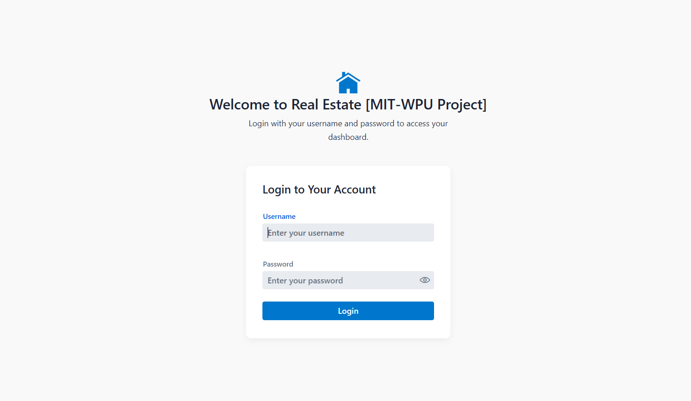
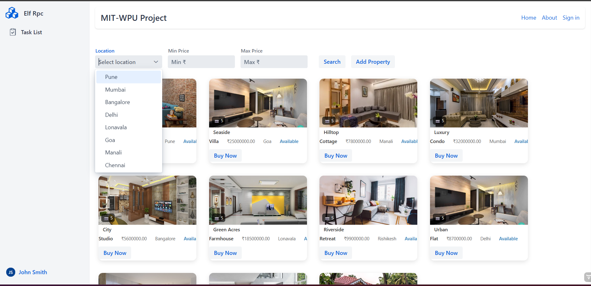
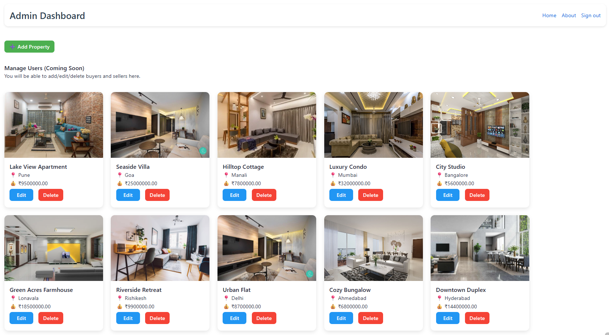
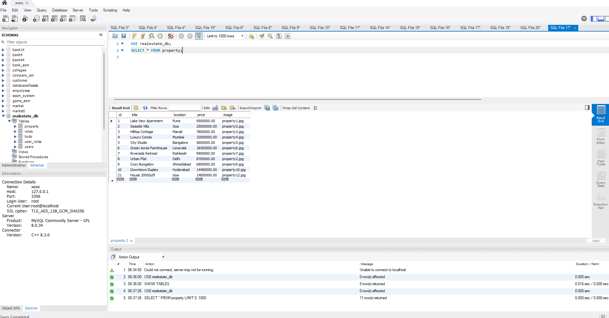

# Real Estate Management System

A full-stack Real Estate Property Listing platform built using Java, Spring Boot, Vaadin, and MySQL.

This application allows users to browse properties, register as buyers/sellers, manage listings, and perform secure login with role-based access.

---

## Tech Stack

- Java 17
- Spring Boot
- Vaadin (UI Framework)
- MySQL Database
- Maven
- Spring Security

---

## Features

- User authentication & login
- Buyer & Seller dashboards
- Property listing & management
- Add / Edit / Delete properties
- Admin controls
- Role-based access
- Database integration
- Responsive UI using Vaadin

---

## Screenshots

### Login Page

### Property Listing

### Add Property

### Buyer Dashboard

### Database Tables

---

## Database Structure

Tables used:

- users
- roles
- user_roles
- property
- todo

---

## How to Run Project

1. Clone repository

